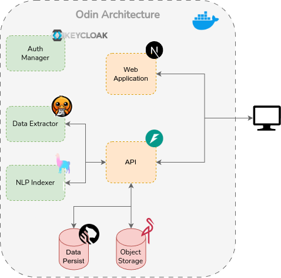

# Project Odin

In the digital age, individuals and organizations are often overwhelmed by vast amounts of information stored across numerous documents and files. While search engines and research platforms like Scopus offer keyword-based search and document organization, there is still a need for a personal, intuitive, and intelligent system that can analyze, organize, and make sense of user-uploaded documents.

Odin addresses this challenge by providing an innovative file repository platform that extracts, analyses, and indexes text and metadata from uploaded documents. The system enables keyword-based searches, highlights relevant document sections, and offers AI-powered insights into single or multiple documents through an interactive chat interface. By streamlining document management and analysis, Odin acts as a personal knowledge hub, empowering users to extract actionable insights from their own data.

[Video](https://uapt33090-my.sharepoint.com/personal/vmabarros_ua_pt/_layouts/15/stream.aspx?id=%2Fpersonal%2Fvmabarros%5Fua%5Fpt%2FDocuments%2Fmei%2Dtdw%2Dp1%2Emp4&nav=eyJyZWZlcnJhbEluZm8iOnsicmVmZXJyYWxBcHAiOiJPbmVEcml2ZUZvckJ1c2luZXNzIiwicmVmZXJyYWxBcHBQbGF0Zm9ybSI6IldlYiIsInJlZmVycmFsTW9kZSI6InZpZXciLCJyZWZlcnJhbFZpZXciOiJNeUZpbGVzTGlua0NvcHkifX0&ga=1&referrer=StreamWebApp%2EWeb&referrerScenario=AddressBarCopied%2Eview%2E758fd81d%2De78a%2D400f%2D8b14%2D791961c1b925)

---

## Authors

- [Vicente Barros](https://github.com/v1centebarros)
- [Mariana Andrade](https://github.com/MarianaAndrad)

## Key Features

1. **File Upload and Analysis**
   
   - [x] Support for multiple document types (PDF).
   - [x] Text scraping and content extraction.
   - [x] Automatic identification of keywords and metadata.

2. **Document Search Engine**
   
   - [x] Keyword or phrase-based search functionality.
   - [x] Display of related documents based on search queries.
   - [x] Highlighting key parts in documents where keywords/phrases appear.

3. **Document Organization**
   
   - [x] Automatic indexing and categorization of uploaded files.
   - [x] Metadata-driven organization for easy document retrieval.

4. **AI-Powered Chat Interface**
   
   - [x] Chat-like interaction for querying individual documents or document collections.
   - [x] Provide insights, summaries, and answers to user queries using natural language understanding.

5. **User Interface and Experience**
   
   - [x] Simple and intuitive interface for non-technical users.
   - [x] Highlighted results for faster content understanding.
   - [x] File repository dashboard with filters, tags, and keyword summaries.

6. **Data Management and Security**
   
   - [x] Secure file uploads and storage.
   - [x] User-specific repositories and permissions.

---

## Target Audience

- **Researchers and Academics:** Individuals who manage large numbers of documents, papers, and books and need quick access to key content and insights.
- **Students:** Users looking to organize study materials, search through their notes, and find relevant sections quickly for assignments and exams.
- **Professionals (Legal, Corporate, etc.):** Individuals handling documentation-intensive tasks, such as legal contracts, technical reports, or business analysis.
- **Content Creators and Writers:** Writers or analysts who need to quickly identify recurring themes, keywords, or insights from their drafts.

---

## Use Cases

### Use Case 1: Researcher Uploads and Searches Documents

**Workflow:**

1. The researcher uploads a collection of scientific papers (PDF format) into Odin.
2. Odin extracts text, keywords, and metadata from the uploaded documents.
3. The researcher searches for a specific keyword, e.g., "machine learning models."
4. Odin displays a list of related papers, highlighting sections where the keyword appears.
5. The researcher uses the chat feature to ask for a summary of a particular paper or compare insights across multiple papers.

### Use Case 2: Student Preparing for Exams

**Workflow:**

1. The student uploads class notes and e-books into Odin.
2. Odin indexes and organizes the uploaded files based on metadata and keywords.
3. The student searches for exam topics like "quantum physics concepts."
4. Odin highlights key sections related to the topic in the uploaded files.
5. The student interacts with the AI chat to ask questions like, "Explain quantum entanglement," and receives concise answers.

## Technologies Used

